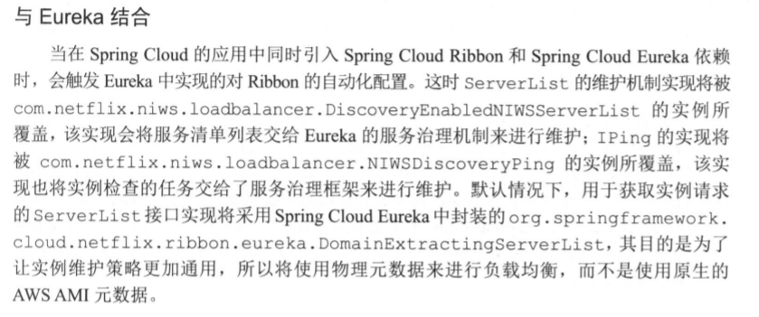

<!-- MarkdownTOC autolink="true" bracket="round" uri_encoding="false" autoanchor="true" -->

- [客户端负载均衡Ribbon组件](#客户端负载均衡ribbon组件)
    - [一 负载均衡策略IRule](#一-负载均衡策略irule)
        - [1.1 RoundRobinRule](#11-roundrobinrule)
        - [1.2 RandomRule](#12-randomrule)
        - [1.3 AvailabilityFilteringRule](#13-availabilityfilteringrule)
        - [1.4 WeightedResponseTimeRule](#14-weightedresponsetimerule)
        - [1.5 RetryRule](#15-retryrule)
        - [1.6 BestAvailableRule](#16-bestavailablerule)
        - [1.7 ZoneAvoidanceRule](#17-zoneavoidancerule)
    - [二 参数配置](#二-参数配置)
        - [三 Ribbon重试机制](#三-ribbon重试机制)

<!-- /MarkdownTOC -->

<a id="客户端负载均衡ribbon组件"></a>
# 客户端负载均衡Ribbon组件
<a id="一-负载均衡策略irule"></a>
## 一 负载均衡策略IRule
<a id="11-roundrobinrule"></a>
### 1.1 RoundRobinRule
轮询策略
<a id="12-randomrule"></a>
### 1.2 RandomRule
随机策略
<a id="13-availabilityfilteringrule"></a>
### 1.3 AvailabilityFilteringRule
过滤掉多次访问故障而处于断路器跳闸状态的服务,还有并发的连接数量超过阀值的服务,然后对剩余服务列表按照轮询策略进行访问
<a id="14-weightedresponsetimerule"></a>
### 1.4 WeightedResponseTimeRule
根据平均响应时间计算所有服务的权重,响应时间越快的服务权重越大被选中的概率越高.刚启动时如果统计信息不足,则使用RoundRobinRule策略,等统计信息足够,会切换到此算法
<a id="15-retryrule"></a>
### 1.5 RetryRule
先按照RoundRobinRule的策略获取服务,如果获取服务失败则在指定时间内会进行重试,获取可用的服务
<a id="16-bestavailablerule"></a>
### 1.6 BestAvailableRule
回显过滤掉由于多次访问故障而处于断路器跳闸状态的服务,然后选择一个并发量最小的服务
<a id="17-zoneavoidancerule"></a>
### 1.7 ZoneAvoidanceRule
默认规则,符合判断server所在区域的性能和server的可用性选择服务器

<a id="二-参数配置"></a>
## 二 参数配置
对于Ribbon参数配置通常有两种方式:全局配置以及客户端配置
- 全局配置:ribbon.<key>=<value>
- 指定客户端配置:<client>.ribbon.<key>=<value>格式进行配置,client可以理解为服务名
对于Ribbon参数的key以及value类型定义,可以查看com.netflix.client.config.CommonClientConfigKey类获取更为详细的配置内容   
没有服务治理框架的帮助,需要为该客户端指定具体的实例清单,指定具体的服务名来做详细的配置
[client.server.name].ribbon.listOfServers=localhost:8001,localhost:8002,localhost:8003

**与Eureka集成**



2:禁用Eureka对Ribbon服务实例的维护实现
```json
ribbon:
  eureka:
    enabled: false  ##启用ribbon
```   


<a id="三-ribbon重试机制"></a>
### 三 Ribbon重试机制
从Camden SR2版本开始,Spring Cloud整合Spring Retry来增强RestTemplate的重试能力。通过RestTemplate实现的服务访问就会自动根据配置来实现重试机制  
启动类加上@EnableRetry注解。  
配置示例
```json
spring:
  cloud:
    loadbalancer:
      retry:
        enabled: true #开启重试机制
#ribbon配置,key-value配置类:CommonClientConfigKey
#need add spring retry
#服务名
eureka-provider:  
  ribbon:  
    ConnectTimeout: 250 #单位ms,请求连接超时时间  
    ReadTimeout: 1000 #单位ms,请求处理的超时时间  
    OkToRetryOnAllOperations: true #对所有操作请求都进行重试  
    MaxAutoRetriesNextServer: 2 #切换实例的重试次数  
    MaxAutoRetries: 1 #对当前实例的重试次数
```          